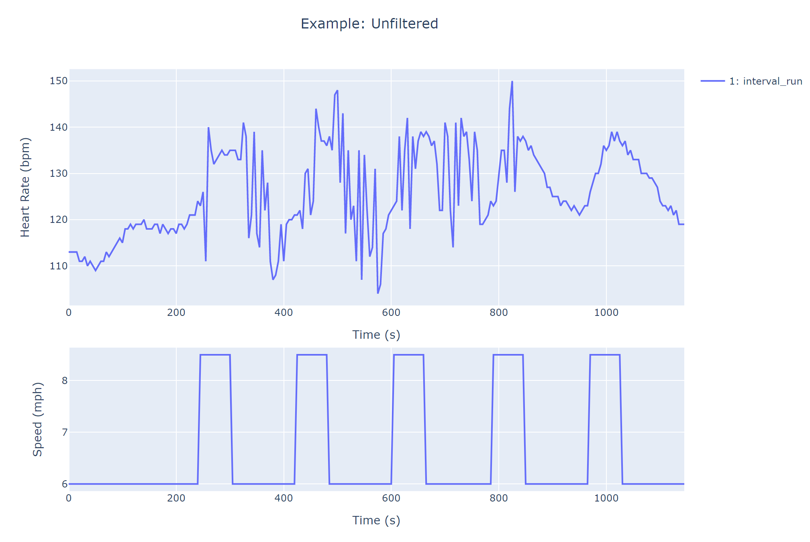

[[English](#heart-rate-filter-le-français-précède)] [[Français](#filtre-de-fréquence-cardiaque-english-follows)]

# Filtre de fréquence cardiaque (English follows) 

Ce filtre utilise un seuil de variation pour identifier les zones de bruit dans les données de fréquence cardiaque, et prédit les vraies valeurs de fréquence cardiaque à l'aide d'une régression linéaire.

## L'algorithme

### 1. Identifiez les zones de bruit, où la fréquence cardiaque fluctue de plus du seuil de variation.

> Chaque intervalle de vitesse est analysé séparément pour le bruit, car on s'attend à ce que la fréquence cardiaque change rapidement si la vitesse change.  L'intervalle 2 contient une quantité importante de bruit entre le temps=415 et le temps=625. Le seuil par défaut est de 10 bpm, et peut être ajusté en fonction du bruit présent dans les données.


### 2. Supprimez les zones de bruit.


### 3. Entraîner une régression logistique.

> Un modèle de régression linéaire est entraîné sur les données restantes de l'intervalle 2 pour prédire les valeurs réelles du bruit supprimé.


### 4. Prédire les valeurs.

> Les valeurs supprimées sont remplacées par les valeurs prédites par la régression linéaire.


## Utilisation

```
$ pip install git+https://github.com/asc-csa/heart-rate-filtering.git
```

```python
import hr_analysis as hr
df = pd.read_csv('data2.csv')
```

Attributs de données requis :
* `protocol_name` : nom de la session
* `date` : date de la session (AAAA-MM-JJ)
* `sessionstarttime` : heure de début de session (YYYY-MM-DD HH:MM:SS)
* `sampletime` : heure d'échantillonnage (YYYY-MM-DD HH:MM:SS)
* `stage` : numéro de l'intervalle de vitesse
* `speed` : vitesse (mph)
* `heartrate_bpm` : fréquence cardiaque (battements par minute)

### Filtrer la fréquence cardiaque

```python
données filtrées = threshold_filter(df.heartrate_bpm.values, intervals_array=df.stage, threshold=5)
```

### Tracé des données brutes

```python
hr.plot(df, 'Example 1 : Unfiltered')
```



### Tracer des données filtrées

> Les filtres incluent :
> * `lowess` : lissage du nuage de points pondéré localement, frac=0.5
> * `mean` : moyenne mobile, fenêtre=7
> * `threshold` : filtre de seuil de variation

```python
hr.plot(data, 'Example 1 : Filtered', filt='threshold', interval=5)
```


### Comparer les filtres

```python
hr.plot_compare(df)
```


## Statut de développement

La solution pour filtrer la fréquence cardiaque est encore en cours de développement. Le seuil utilisé pour le filtrage nécessite
une entrée manuelle, et le filtre de seuil utilise seulement une régression linéaire.
 
 
 
# Heart Rate Filter (Le français précède)

This filter uses a variation threshold to identify areas of noise in the heart rate data, and predicts the true heart rate values using a linear regression.

## The Algorithm

### 1. Identify areas of noise, where the heart rate fluctuates by more than the variation threshold.

> Each speed interval is analyzed for noise separately since it is expected that heart rate will change quickly if the speed changes.  Interval 2 contains a significant amount of noise between time=415 and time=625. The default threshold is 10 bpm, and can be adjusted depending on the noise present in the data.


### 2. Delete areas of noise.


### 3. Train a logistic regression.

> A linear regression model is trained on the remaining data within interval 2 to predict the true values of the deleted noise.


### 4. Predict Values.

> The deleted values are replaced with the predicted values from the linear regression.


## Usage
```
$ pip install git+https://github.com/asc-csa/heart-rate-filtering.git
```

```python
import hr_analysis as hr
df = pd.read_csv('data2.csv')
```

Required data attributes:
* `protocol_name`: session name
* `date`: session date  (YYYY-MM-DD)
* `sessionstarttime`: session start time (YYYY-MM-DD HH:MM:SS)
* `sampletime`: sample time (YYYY-MM-DD HH:MM:SS)
* `stage`: speed interval number
* `speed`: speed (mph)
* `heartrate_bpm`: heart rate (beats per minute)

### Filtering Heart Rate

```python
filtered_data = threshold_filter(df.heartrate_bpm.values, intervals_array=df.stage, threshold=5)
```

### Plotting Raw Data

```python
hr.plot(df, 'Example 1: Unfiltered')
```


### Plotting Filtered Data

> Filters include:
> * `lowess`: locally weighted scatterplot smoothing, frac=0.5
> * `mean`: moving average, window=7
> * `threshold`: variation threshold filter

```python
hr.plot(data, 'Example 1: Filtered', filt='threshold', interval=5)
```


### Compare Filters

```python
hr.plot_compare(df)
```


## Development Status

The solution to filtering heart rate is still in development. The threshold used for filtering requires
a manual input, and the threshold filter only uses a linear regression.
